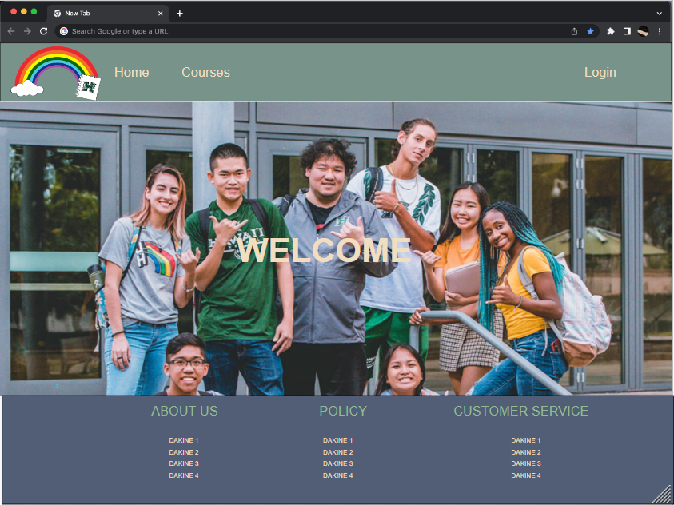
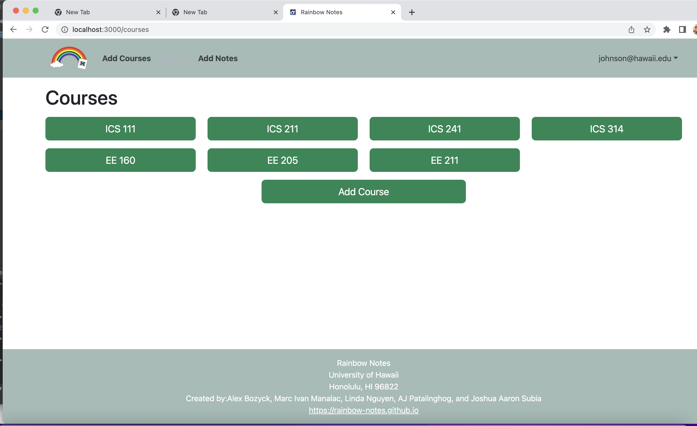
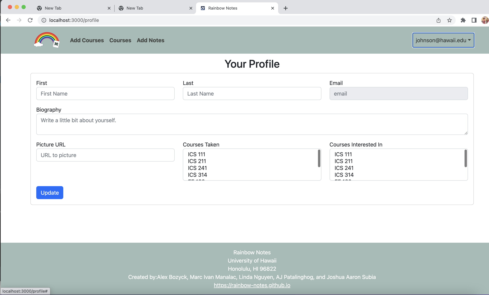
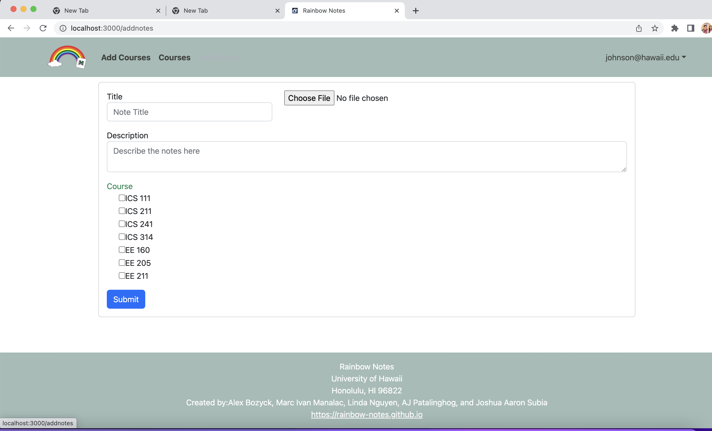
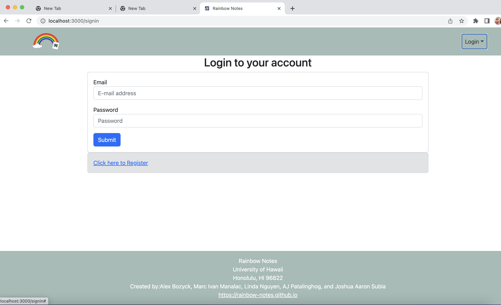
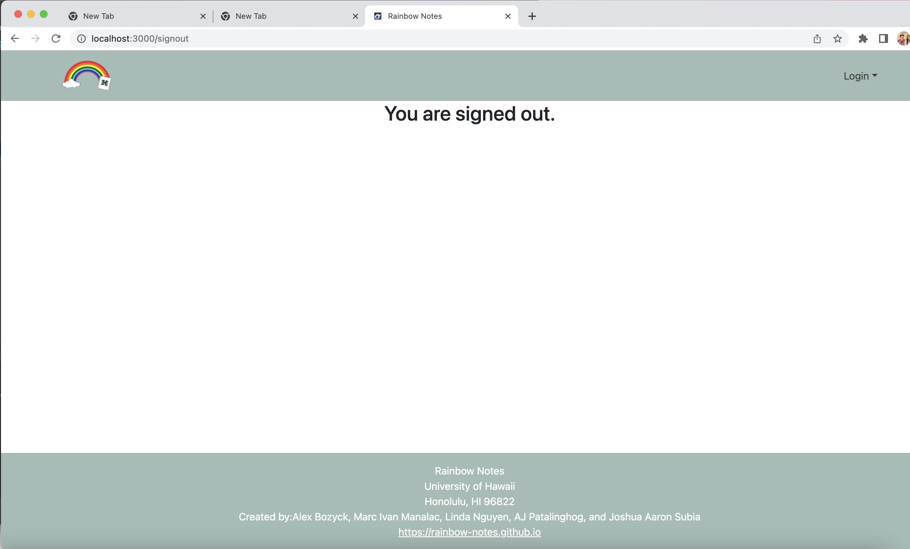
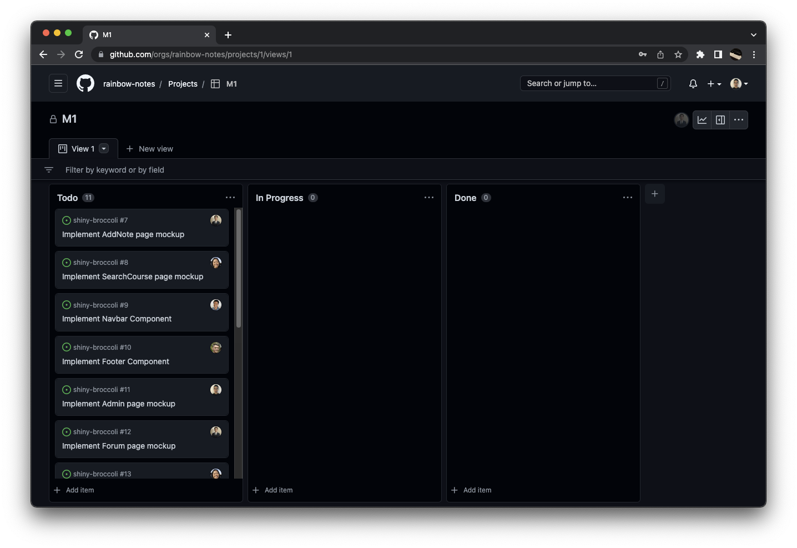
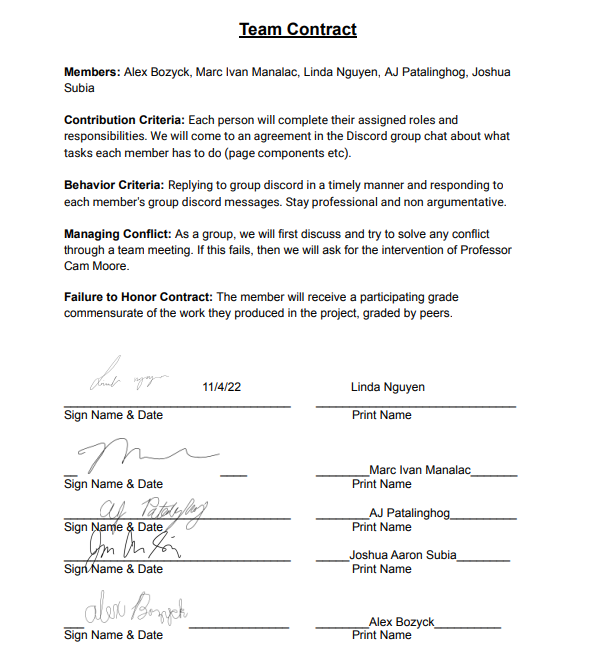

## Rainbow Notes

## Table of contents

* [Overview](#overview)
* [User Guide](#user-guide)
* [Team](#team)
* [Team Contract](#team-contract)
* [Deployment](http://146.190.34.247/)
* [M1 Project](#M1)
* [M2 Project](#M2)

## Overview

The goal of Rainbow Notes is to provide students a place where they can meet or discuss with others who previously took a course. Those who have completed a course can also post their notes for other students to see. In addition, they will be able to answer questions on the forum, which will form a community where students can be helped in the future as well. It will eventually incorporate various technologies such as:

* [Meteor](https://www.meteor.com/) for Javascript-based implementation of client and server code.
* [React](https://reactjs.org/) for component-based UI implementation and routing.
* [React Bootstrap](https://react-bootstrap.github.io/) CSS Framework for UI design.

It will also provide code that implements design concepts including but not limited to the following:

* Two primary collections (Profiles and Courses) as well as two "join" Collections (Notes and User) that implement many-to-many relationships between them.
* Top-level index pages (Profiles and Courses) that show how to manipulate these four collections in various ways.
* Initialization code to define default Profiles and Courses and relations between them.
* Use of Meteor Methods to illustrate how to simplify implementation of multiple collection updates.
* Use of indexes to enforce uniqueness of certain fields in the collections, enabling them to serve as primary keys.
* Authentication using the built-in Meteor accounts package along with Sign Up and Sign In pages.
* Authorization examples: certain pages are public (Profiles and Courses), while other pages require login (AddNote, EditProfile).

## User Guide

This section provides a walkthrough of the planned Rainbow Notes Mock up user interface and its capabilities. It will be heavily based on the [Bowfolios template](https://bowfolios.github.io) which was provided in the ICS 314 Software Engineering class. Some pages that we will most likely be using include:

### Landing Page

The landing page is presented to users when they visit the top-level URL to the site.

### Course Page 

Rainbow Notes course page provides users with a list of courses and an add course option which allows you to add a course to your unique course page. 

### Profile Page
The Profile Page which prompts the user for a first name, last name, email, Bio, courses taken and course interersts. The Profile page also allows for editing of a profile.

### Notes Page
The Notes Page will Display the Notes that are associated with each course along with a rating. More stars the better note it is. 

## Development History

The development process for BowFolios conformed to [Issue Driven Project Management](http://courses.ics.hawaii.edu/ics314f19/modules/project-management/) practices. In a nutshell:

* Development consists of a sequence of Milestones.
* Each Milestone is specified as a set of tasks.
* Each task is described using a GitHub Issue, and is assigned to a single developer to complete.
* Tasks should typically consist of work that can be completed in 2-4 days.
* The work for each task is accomplished with a git branch named "issue-XX", where XX is replaced by the issue number.
* When a task is complete, its corresponding issue is closed and its corresponding git branch is merged into master.
* The state (todo, in progress, complete) of each task for a milestone is managed using a GitHub Project Board.

The following sections document the development history of BowFolios.

### Milestone 1: 

The goal of Milestone 1 was to create a set of *React* pages that we previously made Mockups for.  We ended up creating more pages than we originally planned. As of November 17, the project is as follows:

### Landing Page

### Course Page

### Profile Page

### Add Notes Page

### Login Page

### Log Out Page

## M1
Milestone 1 was managed using [Rainbow Notes GitHub Project Board M1](https://github.com/orgs/rainbow-notes/projects/1):

## M2
Milestone 2 was managed using [Rainbow Notes GitHub Project Board M2](https://github.com/orgs/rainbow-notes/projects/3):
## Team
Rainbow Notes is designed, implemented, and maintained by [Alex Bozyck](https://abozb01.github.io/), [Marc Ivan Manalac](https://marcivanmanalac.github.io/), [Linda Nguyen](https://lindanguyen25.github.io), [AJ Patalinghog](https://aj-patalinghog.github.io), and [Joshua Aaron Subia](https://josh-subia.github.io/).

## Team Contract

