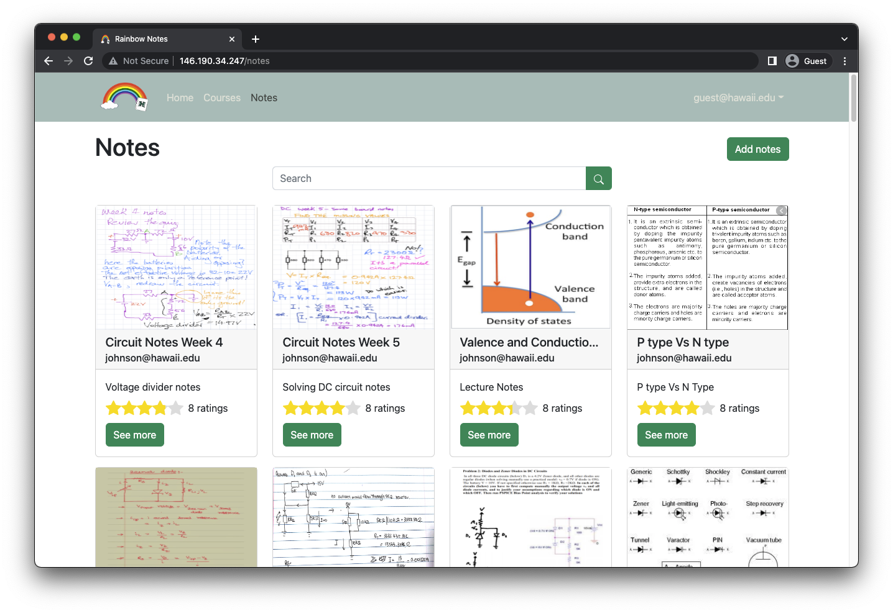
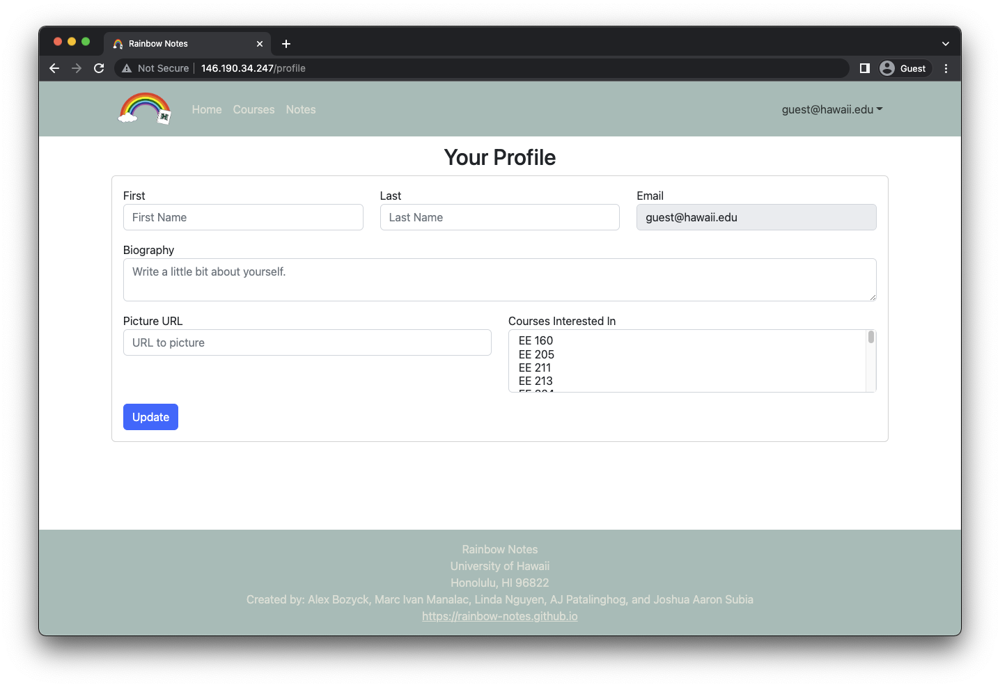
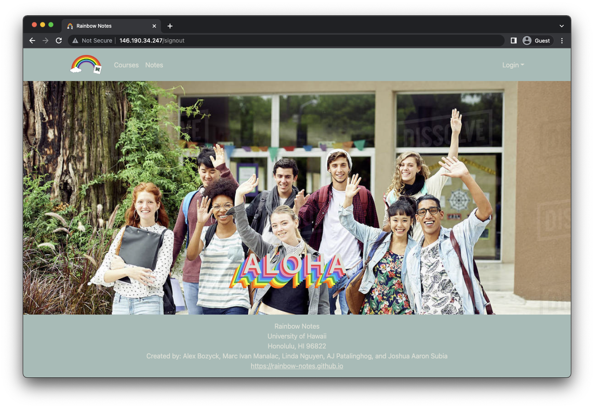

## Rainbow Notes


## Table of contents

* [Overview](#overview)
* [Deployment](#deployment)
* [User Guide](#user-guide)
* [Developer Guide](#developer-guide)
* [Development History](#development-history)
* [Team Contract](#team-contract)
* [Team](#team)

## Overview

The goal of Rainbow Notes is to provide students a place where they can meet or discuss with others who previously took a course. Those who have completed a course can post their notes for other students to see. This forms a community where future students can refer to for help as well. It incorporates various technologies such as:

* [Meteor](https://www.meteor.com/) for Javascript-based implementation of client and server code.
* [React](https://reactjs.org/) for component-based UI implementation and routing.
* [React Bootstrap](https://react-bootstrap.github.io/) CSS Framework for UI design.

It also provides code that implements design concepts including but not limited to the following:

* Four collections (Profiles, Courses, Notes and Ratings) that implement many-to-many relationships between them.
* Top-level index pages (Courses, Notes, and Profile) that show how to manipulate these four collections in various ways.
* Initialization code to define default Profiles, Courses, and Notes as well as the relations between them.
* Use of Meteor Methods to illustrate how to simplify implementation of multiple collection updates.
* Use of indexes to enforce uniqueness of certain fields in the collections, enabling them to serve as primary keys.
* Authentication using the built-in Meteor accounts package along with Sign Up and Sign In pages.
* Authorization examples: certain pages are public (Landing and Courses), while other pages require login (AddNote, EditProfile).

## Deployment

Our website was deployed through DigitalOcean and can be found here: [Rainbow Notes](http://146.190.34.247/)

## User Guide

This section provides a walkthrough of the Rainbow Notes user interface and its capabilities.

### Landing Page

The landing page is presented to users when they visit the top-level URL to the site.


### Sign In and Sign Up Pages

Click on the "Login" button in the upper right corner of the navbar, then select "Sign in" to go to the following page and login. You must have been previously registered with the system to use this option:


Alternatively, you can select "Sign up" to go to the following page and register as a new user:


### Courses Page 

The courses page provides you with a list of courses and an option to add ones that aren't included. The number of notes within a course is also listed next to each course name.


### Individual Course Pages

By clicking on any course button, you will be redirected to a separate course page which lists all of the notes within that course.


### Add Course Page

The add course page allows you to create courses which aren't already listed. It verifies that the course doesn't exist before creating one to prevent duplicates.


### Notes Page

The notes page provides you with a list of all available notes and an option to add notes as well.



### Individual Note Pages

By clicking on the see more button, you will be redirected to a separate note page where you can view and rate each note.


### Add Notes Page

The add notes page allows you to upload images of your course notes in addition to a title and description.


### Profile Page

The profile pages prompts you for a first and last name, email, biography, in addition to your courses taken and course interests. The Profile page also allows for editing of a profile.



### Sign Out Page

The sign out page is what you will see once you log out of your profile.



## Developer Guide

This section provides information of interest to Meteor developers wishing to use this code base as a basis for their own development tasks.

### Installation

First, [install Meteor](https://www.meteor.com/install).

Second, visit the [Rainbow Notes application github page](https://github.com/rainbow-notes/rainbow-notes), and click the "Use this template" button to create your own repository initialized with a copy of this application. Alternatively, you can download the sources as a zip file or make a fork of the repo.  However you do it, download a copy of the repo to your local computer.

Third, cd into the rainbow-notes/app directory and install libraries with:

```
$ meteor npm install
```

Fourth, run the system with:

```
$ meteor npm run start
```

If all goes well, the application will appear at [http://localhost:3000](http://localhost:3000).

## Continuous Integration


Rainbow Notes uses [GitHub Actions](https://docs.github.com/en/free-pro-team@latest/actions) to automatically run ESLint and TestCafe each time a commit is made to the default branch.  You can see the results of all recent "workflows" at [https://github.com/rainbow-notes/rainbow-notes/actions](https://github.com/rainbow-notes/rainbow-notes/actions).

The workflow definition file is quite simple and is located at
[.github/workflows/ci.yml](https://github.com/rainbow-notes/rainbow-notes/blob/main/.github/workflows/ci.yml).

## Development History

The development process for Rainbow Notes conformed to [Issue Driven Project Management](http://courses.ics.hawaii.edu/ics314f19/modules/project-management/) practices. In a nutshell:

* Development consists of a sequence of Milestones.
* Each Milestone is specified as a set of tasks.
* Each task is described using a GitHub Issue, and is assigned to a single developer to complete.
* Tasks should typically consist of work that can be completed in 2-4 days.
* The work for each task is accomplished with a git branch named "issue-XX", where XX is replaced by the issue number.
* When a task is complete, its corresponding issue is closed and its corresponding git branch is merged into master.
* The state (todo, in progress, complete) of each task for a milestone is managed using a GitHub Project Board.

The following sections document the development history of Rainbow Notes.

### Milestone 1

The goal of Milestone 1 was to create a set of React page mockups. The pages which were implemented are:

* Landing Page
* Sign In Page
* Sign Up Page
* Courses Page
* Add Notes Page
* Profile Page
* Sign Out Page

Milestone 1 was managed using [Rainbow Notes GitHub Project Board M1](https://github.com/orgs/rainbow-notes/projects/1).


## Milestone 2

The goal of Milestone 2 was to improve the functionality and design of our application through the use of MongoDB. Improvements include:

* New pages:
  * Individual Course Pages
  * Add Course Page
  * Notes Page
  * Individual Note Pages
* New MongoDB collections:
  * Courses collection
  * Notes collection
  * Ratings collection

Milestone 2 was be managed using [Rainbow Notes GitHub Project Board M2](https://github.com/orgs/rainbow-notes/projects/3).


## Milestone 3

The goal of Milestone 3 is to improve the functionality of profiles and personalization of the website for each user.

Milestone 3 will be managed using [Rainbow Notes GitHub Project Board M2](https://github.com/orgs/rainbow-notes/projects/3).


## Team Contract

The Team Contract can be accessed [here](https://docs.google.com/document/d/1BYhkQZ8t0XISmMmo7v_vEQqs3v2YHlsyFllaGU7u8lg/edit?usp=sharing).

## Team

Rainbow Notes is designed, implemented, and maintained by [Alex Bozyck](https://abozb01.github.io/), [Marc Ivan Manalac](https://marcivanmanalac.github.io/), [Linda Nguyen](https://lindanguyen25.github.io), [AJ Patalinghog](https://aj-patalinghog.github.io), and [Joshua Aaron Subia](https://josh-subia.github.io/).
