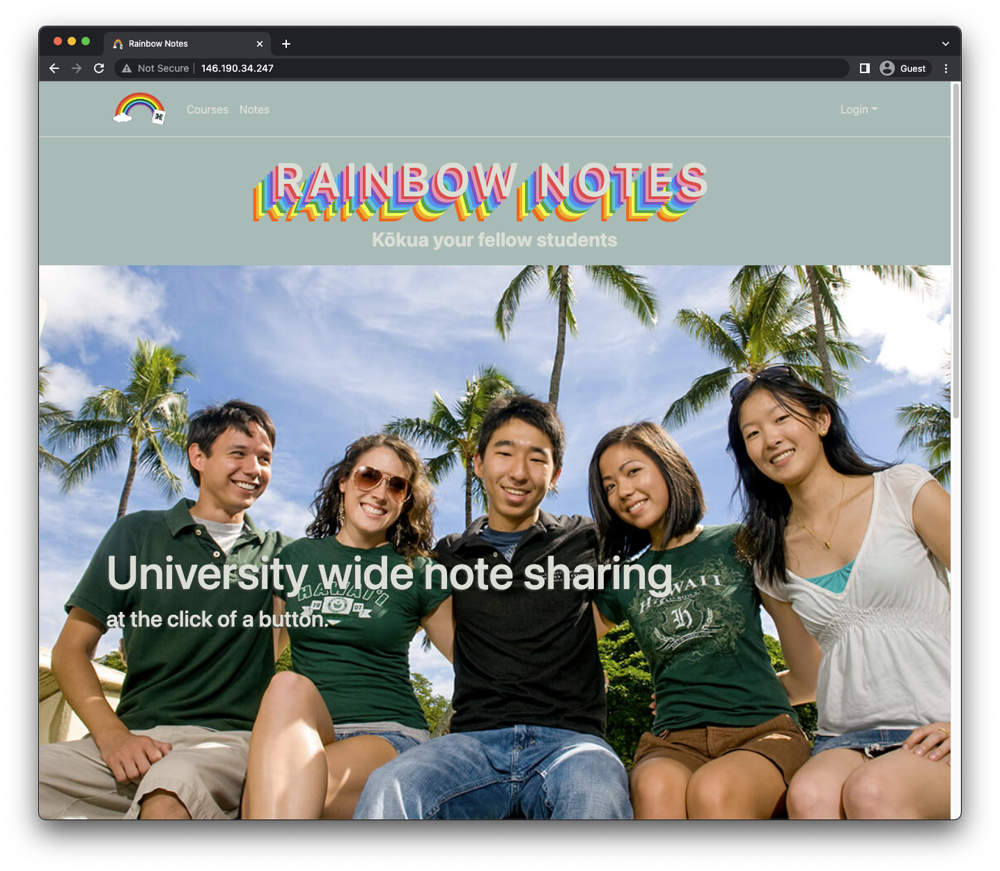
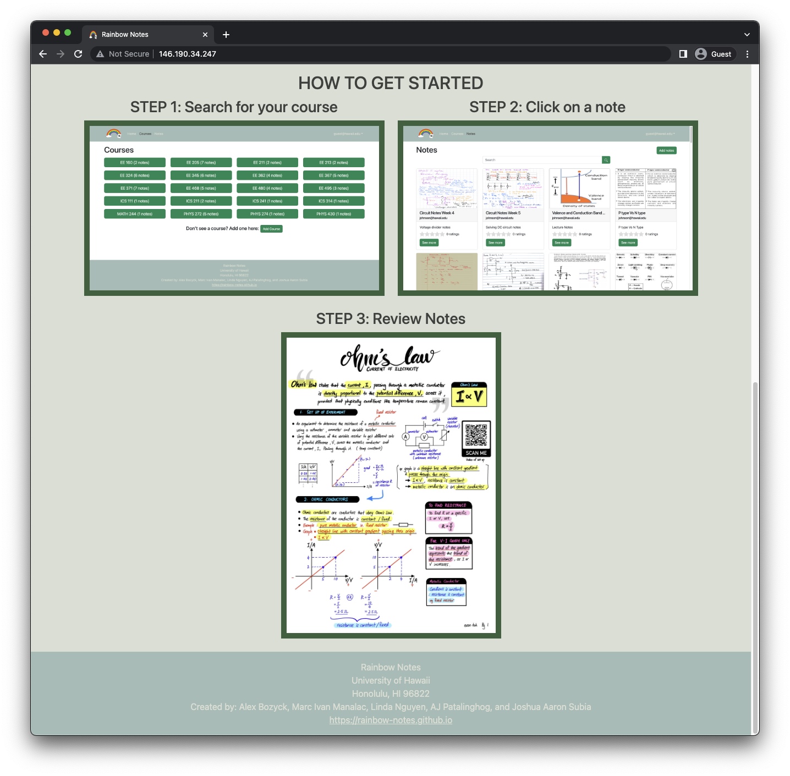
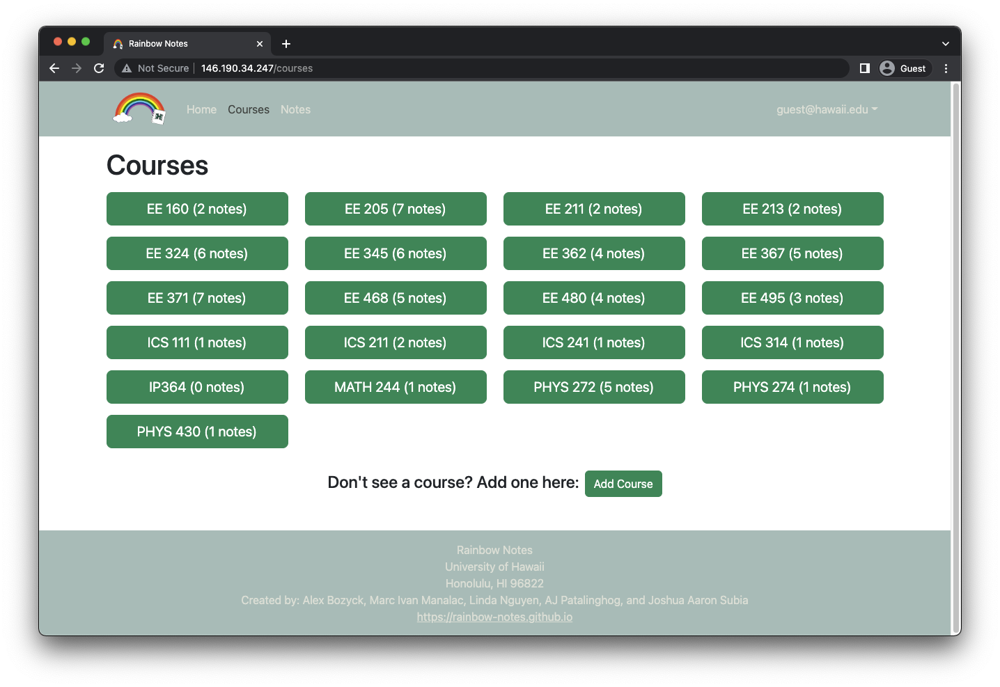

## Rainbow Notes

## Table of contents

* [Overview](#overview)
* [User Guide](#user-guide)
* [Deployment](#deployment)
* [Development History](#development-history)
* [Team Contract](#team-contract)
* [Team](#team)

## Overview

The goal of Rainbow Notes is to provide students a place where they can meet or discuss with others who previously took a course. Those who have completed a course can also post their notes for other students to see. In addition, they will be able to answer questions on the forum, which will form a community where students can be helped in the future as well. It will eventually incorporate various technologies such as:

* [Meteor](https://www.meteor.com/) for Javascript-based implementation of client and server code.
* [React](https://reactjs.org/) for component-based UI implementation and routing.
* [React Bootstrap](https://react-bootstrap.github.io/) CSS Framework for UI design.

It will also provide code that implements design concepts including but not limited to the following:

* Two primary collections (Profiles and Courses) as well as two "join" Collections (Notes and Forums) that implement many-to-many relationships between them.
* Top-level index pages (Profiles and Courses) that show how to manipulate these four collections in various ways.
* Initialization code to define default Profiles and Courses and relations between them.
* Use of Meteor Methods to illustrate how to simplify implementation of multiple collection updates.
* Use of indexes to enforce uniqueness of certain fields in the collections, enabling them to serve as primary keys.
* Authentication using the built-in Meteor accounts package along with Sign Up and Sign In pages.
* Authorization examples: certain pages are public (Profiles and Courses), while other pages require login (AddNote, EditProfile).

## User Guide

This section provides a walkthrough of the Rainbow Notes user interface and its capabilities.

### Landing Page

The landing page is presented to users when they visit the top-level URL to the site.

### Sign In and Sign Up Pages

Click on the "Login" button in the upper right corner of the navbar, then select "Sign in" to go to the following page and login. You must have been previously registered with the system to use this option:

Alternatively, you can select "Sign up" to go to the following page and register as a new user:

### Courses Page 

The course page provides users with a list of courses and an option to add ones that aren't included. 

### Add Notes Page
The add notes page allows users to upload images of their course notes in addition to a title and description.

### Forum Page
The forum page provides users a place to ask and answer questions. There are several filtering options so users can search by specific features or categories.

### Profile Page
The profile pages prompts the user for a first and last name, email, biography, in addition to their courses taken and course interests. The Profile page also allows for editing of a profile.

### Sign Out Page
The sign out page is what users will see once they log out of their profile.

## Deployment
Our website was deployed using Digital Ocean and can be found here: [Rainbow Notes](http://146.190.34.247/)

## Development History

The development process for Rainbow Notes conformed to [Issue Driven Project Management](http://courses.ics.hawaii.edu/ics314f19/modules/project-management/) practices. In a nutshell:

* Development consists of a sequence of Milestones.
* Each Milestone is specified as a set of tasks.
* Each task is described using a GitHub Issue, and is assigned to a single developer to complete.
* Tasks should typically consist of work that can be completed in 2-4 days.
* The work for each task is accomplished with a git branch named "issue-XX", where XX is replaced by the issue number.
* When a task is complete, its corresponding issue is closed and its corresponding git branch is merged into master.
* The state (todo, in progress, complete) of each task for a milestone is managed using a GitHub Project Board.

The following sections document the development history of Rainbow Notes.

### Milestone 1

The goal of Milestone 1 was to create a set of React page mockups. The pages which have implemented are:

* Landing Page
* Sign In Page
* Sign Up Page
* Courses Page
* Add Notes Page
* Forum Page
* Profile Page
* Sign Out Page

Milestone 1 was managed using [Rainbow Notes GitHub Project Board M1](https://github.com/orgs/rainbow-notes/projects/1).

## Milestone 2
The goal of Milestone 2 is to improve the functionality and design of our application through the use of MongoDB.

Milestone 2 will be managed using [Rainbow Notes GitHub Project Board M2](https://github.com/orgs/rainbow-notes/projects/3).

## Team Contract
The Team Contract can be accessed [here](https://docs.google.com/document/d/1BYhkQZ8t0XISmMmo7v_vEQqs3v2YHlsyFllaGU7u8lg/edit?usp=sharing).

## Team
Rainbow Notes is designed, implemented, and maintained by [Alex Bozyck](https://abozb01.github.io/), [Marc Ivan Manalac](https://marcivanmanalac.github.io/), [Linda Nguyen](https://lindanguyen25.github.io), [AJ Patalinghog](https://aj-patalinghog.github.io), and [Joshua Aaron Subia](https://josh-subia.github.io/).
