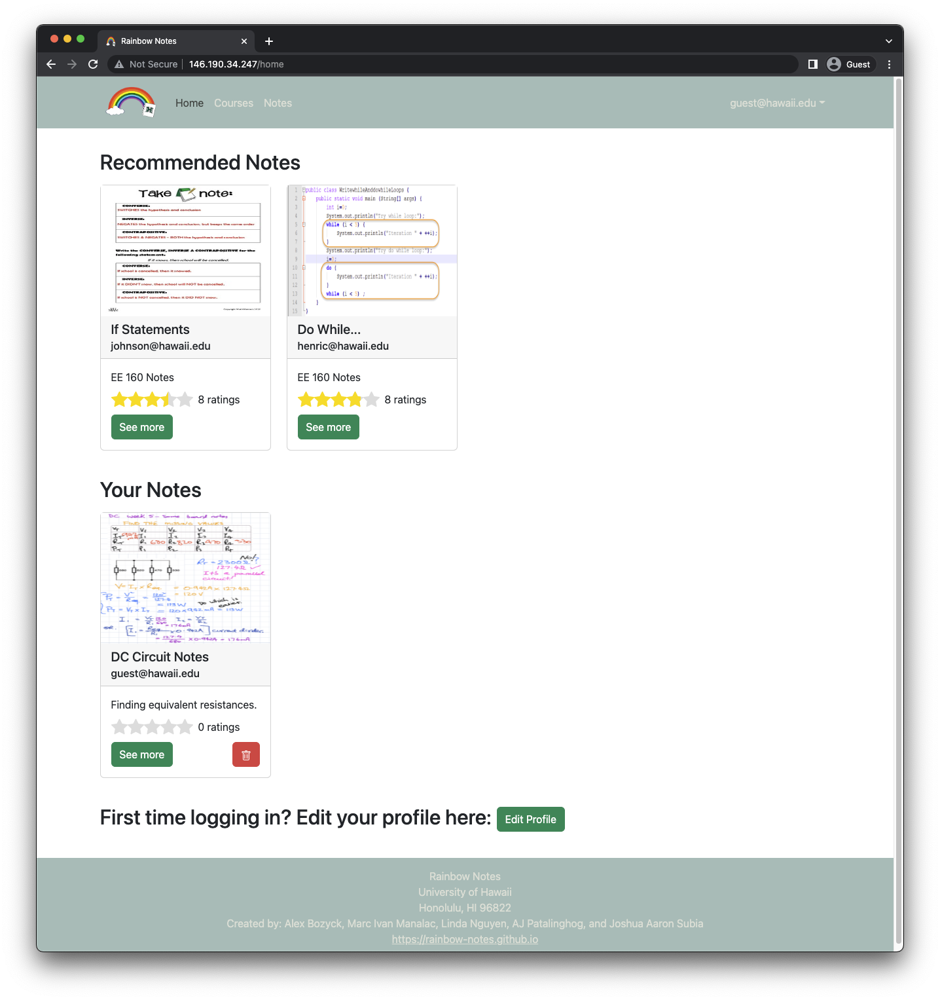
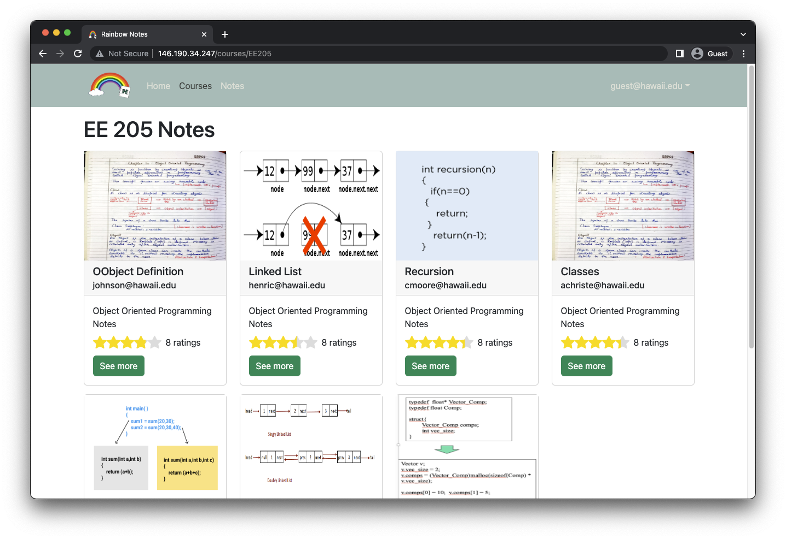
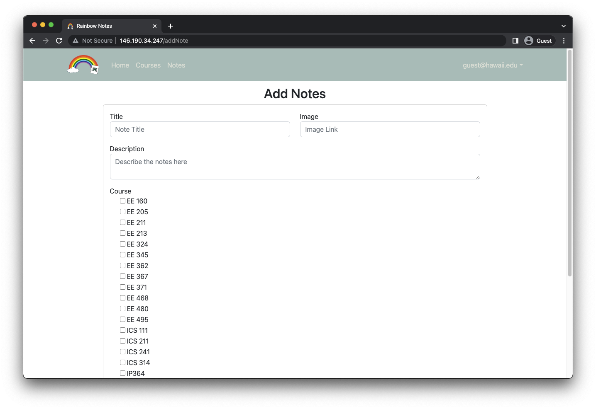

## Rainbow Notes

## Table of contents

* [Overview](#overview)
* [Deployment](#deployment)
* [User Guide](#user-guide)
* [Developer Guide](#developer-guide)
* [Continuous Integration](#continuous-integration)
* [Development History](#development-history)
* [Community Feedback](#community-feedback)
* [Team Contract](#team-contract)
* [Team](#team)

## Overview

The goal of Rainbow Notes is to provide students a place where they can meet or discuss with others who previously took a course. Those who have completed a course can post their notes for other students to see. This forms a community where future students can refer to for help as well. It incorporates various technologies such as:

* [Meteor](https://www.meteor.com/) for Javascript-based implementation of client and server code.
* [React](https://reactjs.org/) for component-based UI implementation and routing.
* [React Bootstrap](https://react-bootstrap.github.io/) CSS Framework for UI design.
* [Uniforms](https://uniforms.tools) for React based form design and display.

It also provides code that implements design concepts including but not limited to the following:

* Four collections (Profiles, Courses, Notes and Ratings) that implement many-to-many relationships between them.
* Top-level index pages (Courses, Notes, and Profile) that show how to manipulate these four collections in various ways.
* Initialization code to define default Profiles, Courses, and Notes as well as the relations between them.
* Use of Meteor Methods to illustrate how to simplify implementation of multiple collection updates.
* Use of indexes to enforce uniqueness of certain fields in the collections, enabling them to serve as primary keys.
* Authentication using the built-in Meteor accounts package along with Sign Up and Sign In pages.
* Authorization examples: certain pages are public (Landing and Courses), while other pages require login (AddNote, EditProfile).
* Use of Meteor Assets to initialize the database (helpful when initialization exceeds settings file size limits).

## Deployment

Our website was deployed through DigitalOcean and can be found here: [Rainbow Notes](http://146.190.34.247/)

## User Guide

This section provides a walkthrough of the Rainbow Notes user interface and its capabilities.

### Landing Page

The landing page is presented to users when they visit the top-level URL of the site.


### Sign In and Sign Up Pages

By clicking on the login button in the upper right corner then selecting sign in, you can go to the following page and login. You must be already registered with the system to use this option.


Alternatively, you can select sign up instead which will go to the following page where you can register as a new user.


### Home Page

Once signed in, you will be redirected to a personalized home page which includes recommended notes based on your course interests. Additionally, you can also see and delete any notes that you have posted.



### Courses Page 

The courses page provides you with a list of courses and an option to add ones that aren't included. The number of notes within a course is also listed next to each course name.


### Individual Course Pages

By clicking on any course button, you will be redirected to a separate course page which lists all of the notes within that course.



### Add Course Page

The add course page allows you to create courses which aren't already listed. It verifies that the course doesn't exist before creating one to prevent duplicates.


### Notes Page

The notes page provides you with a list of all available notes and the ability to search by title. There is also an option to add notes as well.


### Individual Note Pages

By clicking on the see more button, you will be redirected to a separate note page where you can view and rate each note.


### Add Notes Page

The add notes page allows you to upload images of your course notes in addition to a title and description.



### Profile Page

The profile pages prompts you for a first and last name, email, biography, and your courses interests. The profile page also allows for editing of your profile.


### Sign Out Page

The sign out page is what you will see once you log out of your profile.


## Developer Guide

This section provides information of interest to Meteor developers wishing to use this code base as a basis for their own development tasks.

### Installation

First, [install Meteor](https://www.meteor.com/install).

Second, visit the [Rainbow Notes application github page](https://github.com/rainbow-notes/rainbow-notes), and click the Code button to create your own repository with a copy of the application. Alternatively, you can download the sources as a zip file or make a fork of the repo.  However you do it, download a copy of the repo to your local computer.

Third, cd into the rainbow-notes/app directory and install libraries with:

```
$ meteor npm install
```

Fourth, run the system with:

```
$ meteor npm run start

> meteor-application-template-react@ start *path to the app directory*
> meteor --no-release-check --exclude-archs web.browser.legacy,web.cordova --settings ../config/settings.development.json

[[[[[ ~/Desktop/rainbow-notes/app ]]]]]       

=> Started proxy.                             
=> Started HMR server.                        
Browserslist: caniuse-lite is outdated. Please run:
  npx browserslist@latest --update-db
  Why you should do it regularly: https://github.com/browserslist/browserslist#browsers-data-updating
Browserslist: caniuse-lite is outdated. Please run:
  npx browserslist@latest --update-db
  Why you should do it regularly: https://github.com/browserslist/browserslist#browsers-data-updating
=> Started MongoDB.                           
I20221213-19:46:20.580(-10)? Creating the default profiles
I20221213-19:46:20.606(-10)?   Defining profile admin@foo.com
I20221213-19:46:20.803(-10)?   Defining profile user@foo.com
I20221213-19:46:20.899(-10)?   Defining profile johnson@hawaii.edu
I20221213-19:46:21.003(-10)?   Defining profile henric@hawaii.edu
I20221213-19:46:21.102(-10)?   Defining profile cmoore@hawaii.edu
I20221213-19:46:21.197(-10)?   Defining profile achriste@hawaii.edu
I20221213-19:46:21.289(-10)?   Defining profile leighj@hawaii.edu
I20221213-19:46:21.386(-10)?   Defining profile sin8@hawaii.edu
I20221213-19:46:21.497(-10)? Creating default courses.
I20221213-19:46:21.498(-10)?   Adding: ICS 111
I20221213-19:46:21.628(-10)?   Adding: ICS 211
I20221213-19:46:21.631(-10)?   Adding: ICS 241
I20221213-19:46:21.634(-10)?   Adding: ICS 314
I20221213-19:46:21.642(-10)? Creating default notes.
I20221213-19:46:21.643(-10)?   Adding: Circuit Notes Week 4
I20221213-19:46:21.767(-10)?   Adding: Circuit Notes Week 5
I20221213-19:46:21.770(-10)?   Adding: Valence and Conduction Band Week 3
I20221213-19:46:21.774(-10)?   Adding: P type Vs N type
I20221213-19:46:21.778(-10)?   Adding: Zener Diode Circuit
I20221213-19:46:21.782(-10)? Loading courses from private/courses.json
I20221213-19:46:21.835(-10)? Loading notes from private/notes.json
I20221213-19:46:23.737(-10)? Monti APM: completed instrumenting the app
=> Started your app.

=> App running at: http://localhost:3000/
```

If all goes well, the application will appear at [http://localhost:3000](http://localhost:3000).

### Initialization

The [config](https://github.com/rainbow-notes/rainbow-notes/tree/main/config) directory is intended to hold settings files. The repository contains one file: [config/settings.development.json](https://github.com/rainbow-notes/rainbow-notes/blob/main/config/settings.development.json).

This file contains default definitions for Profiles, Notes, and Courses and the relationships between them.

The settings.development.json file contains two fields called "loadNotesFile" and "loadCoursesFile". When set to true, then the data in the files app/private/notes.json and app/private/courses.json will also be loaded. The code to do this illustrates how to initialize a system when the initial data exceeds the size limitations for the settings file.

### Quality Assurance - ESLint

Rainbow Notes includes a [.eslintrc.js](https://github.com/rainbow-notes/rainbow-notes/blob/main/app/.eslintrc.js) file to define the coding style adhered to in this application. You can invoke ESLint from the command line which will show the following when there are no errors.

```
$ meteor npm run lint

> meteor-application-template-react@ lint *path to the app directory*
> eslint --quiet --ext .jsx --ext .js ./imports && eslint --quiet --ext .js ./tests

$
```
ESLint should run without generating any errors. It’s significantly easier to do development with ESLint integrated directly into your IDE (such as IntelliJ).

## Continuous Integration


Rainbow Notes uses [GitHub Actions](https://docs.github.com/en/free-pro-team@latest/actions) to automatically run ESLint and TestCafe each time a commit is made to the default branch.  You can see the results of all recent "workflows" at [https://github.com/rainbow-notes/rainbow-notes/actions](https://github.com/rainbow-notes/rainbow-notes/actions).

The workflow definition file is located at
[.github/workflows/ci.yml](https://github.com/rainbow-notes/rainbow-notes/blob/main/.github/workflows/ci.yml).

## Development History

The development process for Rainbow Notes conformed to [Issue Driven Project Management](http://courses.ics.hawaii.edu/ics314f19/modules/project-management/) practices. In a nutshell:

* Development consists of a sequence of Milestones.
* Each Milestone is specified as a set of tasks.
* Each task is described using a GitHub Issue, and is assigned to a single developer to complete.
* Tasks should typically consist of work that can be completed in 2-4 days.
* The work for each task is accomplished with a git branch named "issue-XX", where XX is replaced by the issue number.
* When a task is complete, its corresponding issue is closed and its corresponding git branch is merged into master.
* The state (todo, in progress, complete) of each task for a milestone is managed using a GitHub Project Board.

The following sections document the development history of Rainbow Notes.

### Milestone 1

The goal of Milestone 1 was to create a set of React page mockups. The pages which were implemented are as follows:

* Landing Page
* Sign In Page
* Sign Up Page
* Courses Page
* Add Notes Page
* Profile Page
* Sign Out Page

Milestone 1 was managed using [Rainbow Notes GitHub Project Board M1](https://github.com/orgs/rainbow-notes/projects/1).


## Milestone 2

The goal of Milestone 2 was to improve the functionality and design of our application through the use of MongoDB. Improvements include:

* New pages:
  * Individual Course Pages
  * Add Course Page
  * Notes Page
  * Individual Note Pages
* New MongoDB collections:
  * Courses collection
  * Notes collection
  * Ratings collection

Milestone 2 was managed using [Rainbow Notes GitHub Project Board M2](https://github.com/orgs/rainbow-notes/projects/3).


## Milestone 3

The goal of Milestone 3 was to improve the functionality of profiles and personalization of the website for each user. Improvements include:

* New pages:
  * Personalized Home Page
  * Admin Profiles Page
* New MongoDB collection:
  * Profiles collection
* New Admin role:
  * Able to manage the application and remove any course, note, or profile.

Milestone 3 was managed using [Rainbow Notes GitHub Project Board M3](https://github.com/orgs/rainbow-notes/projects/4).


## Community Feedback

Rainbow Notes is an application designed for our community and so we've asked some members on what they liked as well as some improvements. Here are some of their thoughts:

Treyton L.
* Likes: Idea of the application, ratings, ability to delete notes
* Improvements: Maybe some folders for the notes, able to delete notes for the user (what if the user took a bad note or doesn't want it anymore?)
* Rating: 9/10

Jericho M.
* Likes: Home page and pictures look nice, design is easy to follow, easy to delete and add notes
* Improvements: Don’t need two “edit profile” buttons on the initial home page, ability to edit notes, leave detailed review instead of just star rating, bookmark notes for personal ease of access, add an “only text” option for notes/don’t make pictures required for every note, allow adding multiple course interests at once (I think I broke mine when I tried because I'm on an iPad)
* Rating: 7/10

Tammy N.
* Likes: Straightforward UI, search function 👌, user-centered design
* Improvements: add attachments instead of just links, implement add new course option in the add notes section to make it simpler, website name that doesn’t look like it’s leaking my IP address
* Rating: 8/10

Tim P.
* Likes: Simplicity of website design (not overly complicated for no reason). Ability to self-add courses that aren’t already listed. Ability to rate other people’s notes.
* Improvements: There are two “edit profile” buttons in the home page. Speaking of profiles, there is an option to add a biography and profile picture, however there doesn’t seem to be any way of checking other people’s profiles, so will anybody ever actually see my bio/picture? Additionally, on login there does not seem to be any “forgot password” option yet.
* Rating: 8/10

Jason K.
* Likes: The core concept is great and it would definitely be useful for many students to have consolidated notes specifically for UH classes.  
* Improvements: Make the Home, Courses, Notes and Profiles buttons contrast the background color more to make them more visible. Also make the buttons bigger. This may be the size of my screen but arrange the How to Get Started page so either all the steps are aligned horizontally or vertically
* Rating: 6.9/10

### Further Enhancements
As a result of the community feedback and our own reflections, we realized that there are many improvements that can still be implemented. Some examples include:

* More user-friendly color scheme that has higher contrast
* Implement https and create a custom domain name
* Ability to verify emails and to reset passwords
* Profiles List page where you can see other users and the notes that they have posted
* Favorite another user or a certain note for easy access
* Ability to edit notes, use file attachments rather than image links, and to comment on a note
* Sorting notes by rating or other filters

## Team Contract

The Team Contract can be accessed [here](https://docs.google.com/document/d/1BYhkQZ8t0XISmMmo7v_vEQqs3v2YHlsyFllaGU7u8lg/edit?usp=sharing).

## Team

Rainbow Notes is designed, implemented, and maintained by [Alex Bozyck](https://abozb01.github.io/), [Marc Ivan Manalac](https://marcivanmanalac.github.io/), [Linda Nguyen](https://lindanguyen25.github.io), [AJ Patalinghog](https://aj-patalinghog.github.io), and [Joshua Aaron Subia](https://josh-subia.github.io/).
